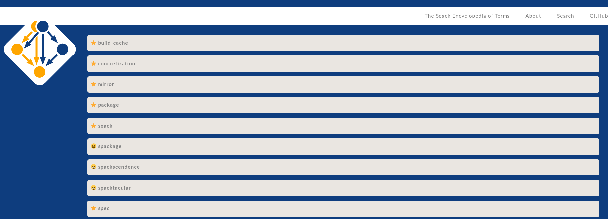

# Spack Encyclopedia (spackpedia)

[](https://github.com/spack/spackpedia/actions?query=branch%3Amain+workflow%3ACI)



## What is the Spack Encyclopedia?

Have you ever made up a special, spack specific term, like a spackage?
Or have you wondered about specific terms in the spack jargon like "spec" or "build cache?"
This is a place you can read about each one, or you can more generally write them all
down in one place! Some terms are for fun like "spackage" and some are considered
spack terminology like "spec." With the spack encyclopedia we can have a little fun, and celebrate
spack!

## How do I contribute?

You can edit or add a new term by editing the [_data/terms.yml](_data/terms.yml)
file. Minimally, you should add:

```yaml
- name: spackage
  definition: A spack package.
  usage: I want to use this cool new software module, but there isn't a spackage for it.
  core: false
```

Where "core" indicates if the term is a core spack (non-made-up) term like "spec," in which
case you should put "true." Otherwise, for made-up or fun terms, put "false" as shown above.
For the name of the term, to keep things simple to parse, if there are multiple words (e.g., build cache)
just include them with a hyphen. And optionally you can also add an image or url. The url will be an external link, and the image
is shown on the term's page.

```yaml
  url: https://spack.github.io/packages
  image: term-image.png
```

The image should be located in [assets/img/terms](assets/img/terms), and make sure if you use any
quotes, you use single quotes `'` and not double `"`. 
If you have any questions, please don't hesitate to [open an issue](https://www.github.com/spack/spackpedia/issues).
